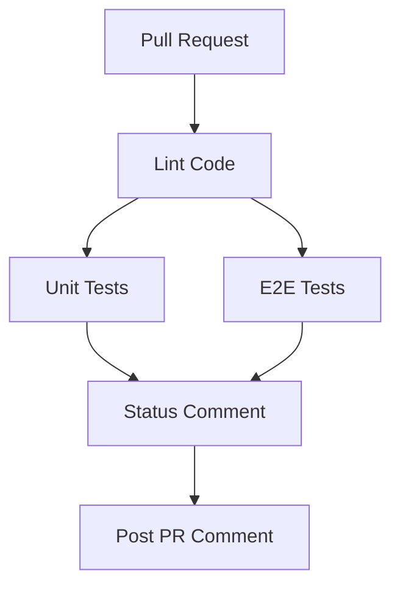

# GitHub Actions Workflows

This directory contains GitHub Actions workflows for CI/CD automation.

## Available Workflows

### 📋 Pull Request CI (`pull-request.yml`)

Automated testing and validation workflow that runs on every pull request.

#### Workflow Structure



#### Jobs Overview

| Job | Description | Runs After | Environment |
|-----|-------------|------------|-------------|
| **lint** | Runs ESLint to check code quality and style | - | default |
| **unit-test** | Executes Vitest unit tests with coverage | lint | default |
| **e2e-test** | Runs Playwright E2E tests | lint | integration |
| **status-comment** | Posts comprehensive status to PR | All jobs pass | default |

#### Job Details

##### 1. Lint Code
- **Purpose**: Validate code style and quality
- **Steps**:
  - Checkout code
  - Setup Node.js 22.14.0
  - Install dependencies
  - Run ESLint

##### 2. Unit Tests
- **Purpose**: Run unit tests and collect coverage
- **Steps**:
  - Checkout code
  - Setup Node.js 22.14.0
  - Install dependencies
  - Run tests with coverage (`npm run test:coverage`)
  - Upload coverage artifacts
  - Generate coverage summary
- **Artifacts**:
  - `unit-test-coverage`: Full coverage report (HTML, JSON)
  - `unit-coverage-summary`: Coverage metrics summary

##### 3. E2E Tests
- **Purpose**: Run end-to-end tests with Playwright
- **Environment**: `integration` (uses secrets from GitHub environment)
- **Steps**:
  - Checkout code
  - Setup Node.js 22.14.0
  - Install dependencies
  - Install Playwright Chromium browser with dependencies
  - Build application
  - Run E2E tests
  - Upload test results and artifacts
  - Generate test summary
- **Required Secrets** (in `integration` environment):
  - `PUBLIC_SUPABASE_URL`: Supabase project URL
  - `PUBLIC_SUPABASE_KEY`: Supabase anonymous key
  - `SUPABASE_SERVICE_ROLE_KEY`: Supabase service role key
- **Artifacts**:
  - `playwright-report`: HTML test report
  - `playwright-test-results`: Test artifacts (screenshots, videos)
  - `e2e-test-summary`: Test execution summary

##### 4. Status Comment
- **Purpose**: Post comprehensive CI status to PR
- **Condition**: Only runs when all previous jobs pass
- **Permissions**: `pull-requests: write`
- **Steps**:
  - Download coverage and test summaries
  - Generate formatted PR comment
  - Post or update comment on PR
- **Comment Includes**:
  - Overall CI status
  - Test results table
  - Code coverage metrics
  - E2E test summary
  - Link to workflow run

#### Configuration

##### Node Version
- **Version**: 22.14.0 (matches project `.nvmrc`)
- **Package Manager**: npm with `npm ci` for reproducible builds

##### Concurrency
- **Strategy**: Cancel in-progress runs for the same PR
- **Group**: `${{ github.workflow }}-${{ github.event.pull_request.number }}`

##### Triggers
- **Events**: `pull_request` (opened, synchronize, reopened)
- **Branches**: `main`, `develop`

##### Playwright Configuration
- **Browser**: Chromium only (as per project guidelines)
- **Installation**: `npx playwright install --with-deps chromium`
- **Base URL**: `http://localhost:3000`

#### Setting Up GitHub Secrets

To use this workflow, configure the following in your GitHub repository:

1. **Create Integration Environment**:
   - Go to: Settings → Environments → New environment
   - Name: `integration`

2. **Add Environment Secrets**:
   ```
   PUBLIC_SUPABASE_URL=https://your-project.supabase.co
   PUBLIC_SUPABASE_KEY=your-anon-key
   SUPABASE_SERVICE_ROLE_KEY=your-service-role-key
   ```

3. **Optional: Add Environment Protection Rules**:
   - Required reviewers
   - Wait timer
   - Deployment branches

#### Artifacts Retention

All artifacts are retained for **7 days** to balance storage costs and debugging needs.

#### Troubleshooting

##### Lint Failures
- **Cause**: Code style violations
- **Fix**: Run `npm run lint:fix` locally

##### Unit Test Failures
- **Cause**: Test logic errors or broken functionality
- **Fix**: Run `npm run test` locally to debug

##### E2E Test Failures
- **Cause**: UI changes, timing issues, or integration problems
- **Fix**: 
  - Run `npm run test:e2e:headed` locally to see browser
  - Use `npm run test:e2e:debug` for step-by-step debugging
  - Check Playwright report artifact in workflow run

##### Missing Secrets
- **Symptom**: E2E job fails with authentication errors
- **Fix**: Verify all secrets are configured in the `integration` environment

##### Browser Installation Issues
- **Symptom**: Playwright fails to install browsers
- **Fix**: Check if `--with-deps` flag is present in install command

#### Best Practices

1. **Local Testing First**: Always run tests locally before pushing
   ```bash
   npm run lint
   npm run test:run
   npm run test:e2e
   ```

2. **Keep Tests Fast**: E2E tests should complete in < 5 minutes
   - Use Page Object Model for maintainability
   - Avoid unnecessary waits
   - Run tests in parallel when possible

3. **Coverage Goals**:
   - Lines: > 80%
   - Statements: > 80%
   - Functions: > 75%
   - Branches: > 70%

4. **PR Comments**: The bot will update the same comment on each push to avoid spam

## Future Enhancements

Potential improvements for the CI/CD pipeline:

- [ ] Add code quality checks (SonarQube, CodeClimate)
- [ ] Implement visual regression testing
- [ ] Add performance testing (Lighthouse CI)
- [ ] Deploy preview environments for PRs
- [ ] Add security scanning (Snyk, Dependabot)
- [ ] Implement automatic dependency updates
- [ ] Add bundle size tracking
- [ ] Generate and publish test coverage badges

## Resources

- [GitHub Actions Documentation](https://docs.github.com/en/actions)
- [Playwright Testing Guide](https://playwright.dev/docs/intro)
- [Vitest Documentation](https://vitest.dev/)
- [ESLint Configuration](../../eslint.config.js)
- [Playwright Configuration](../../playwright.config.ts)
- [Vitest Configuration](../../vitest.config.ts)
